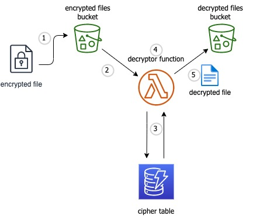

<h1 align="center">decryptor</h1>

<h3 align="center">
	Decrypt and store top-secret messages using a <a href="https://en.wikipedia.org/wiki/Caesar_cipher">Caesar cipher</a>
</h3>

<div align="center">
    </img>
</div>

# Overview

<div align="center">
    </img>
</div>

1. _Encrypted file_ is uploaded to the **encrypted files** S3 bucket
2. File upload triggers the **decryptor** lambda function
3. The **decryptor** function determines the _cipher key_ and retrieves the _cipher_ from the DynamoDB **cipher table**
4. The **decryptor** function then decrypts the encrypted file using the cipher
5. The _decrypted file_ is then uploaded to the **decrypted files** S3 bucket

## Prerequisites

AWS Access

## Getting Started

Clone the repo:

```bash
git clone git@github.com:zakprescott/decryptor.git
```

Install dependencies:

```bash
npm install
```

Set [AWS_PROFILE](https://docs.aws.amazon.com/cli/latest/userguide/cli-configure-profiles.html) environment variable:

```bash
export AWS_PROFILE=your_profile
```

Set ENV environment variable:

```bash
export ENV=your_environment
```

Make a copy of [environment.propertes](./stack/environment.properties) and name it `${ENV}.properties` (where ${ENV} matches what you set for ENV above)

- Replace all instances of `${ENV}` with the value you used for `ENV` above
- Replace `${SOURCE_ACCOUNT}` with your AWS account number

Move ${ENV.properties} to the [.local](./.local) directory

Package the source code:

```bash
npm run package
```

Deploy the stack:

```bash
npm run deploy
```

Test to verify everything works:

```bash
npm test
```

## How It Works

### Create an encrypted message:

For example, let's say we want to encrypt the message `hello, world!` and we want to use a **right shift** of 3. Here's our encrypted message:

```
khoor, zruog!   // encrypted
hello, world!   // decrypted
```

### Create an [encrypted data file](./test/resources/encryptedData.json) with a cipher key and an encrypted message:

```json
{
  "key": 3,
  "message": "khoor, world!"
}
```

### Upload encrypted data file to S3:

```bash
aws s3 cp /path/to/data.json s3://decryptor-encrypted-files
```

### Get the decrypted data:

```bash
aws s3api get-object \
    --bucket decryptor-decrypted-files \
    --key decrypted-data.txt
```

## Running Tests

### Unit Tests

```bash
npm run test:unit
```

### Integration Tests

```bash
npm run test:integration
```
